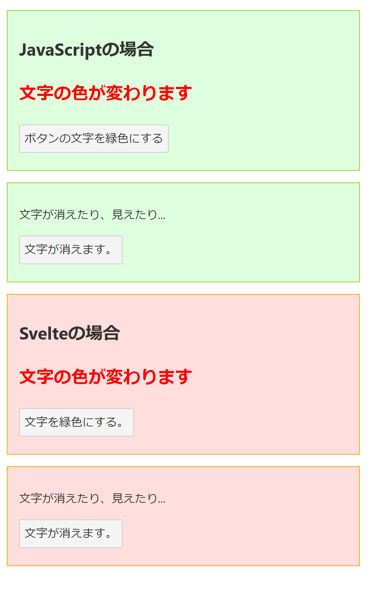

# svelte-hello

+ Svelteの基本構造を理解する、jQueryとの比較

## Svelte の書き方

ここでは jQury と Svelte で同じ機能を実装した。（https://canvaspace.xyz/blog/301 を参考にしました）

画面 (html/css) と動作 (js) は、

+ jQuery では [/public/index.html](https://github.com/morimoto-hiroshi/svelte-hello/blob/main/public/index.html) に記述する。

+ Svelte では [/src/App.svelte](https://github.com/morimoto-hiroshi/svelte-hello/blob/main/src/App.svelte) に記述する。

これがコンパイルされて /public/build/bundle.css, /public/build/bundle.js として配置され /public/index.html からインクルードされる。



## ローカルディレクトリの構築メモ

### svelte app のテンプレートをダウンロード

この [Svelte](https://svelte.dev) アプリのテンプレートは https://github.com/sveltejs/template にある。（なお保守は終了している）

テンプレートからのプロジェクト生成には [degit](https://github.com/Rich-Harris/degit) を用いる。

```
npx degit sveltejs/template svelte-hello
cd svelte-hello
```

### node.js 依存ファイルのインストールと実行

```
npm install
npm run dev
```

[Rollup](https://rollupjs.org) でバンドルと実行がなされるという。
[localhost:8080](http://localhost:8080) でアクセスする。

### github アップロード

+ リモートリポジトリ作成
https://github.com/

+ ローカルリポジトリ初期化
```
git init
```

+ プロフィールを使い分ける
```
git config --local user.name "****************"
git config --local user.email "****************"
git config --local core.autocrlf true
git config --list --local
```

+ アップロード（※の前に .gitignoreがあることを確認）
```
git add .
git commit -m "first commit"
git branch -M main
git remote add origin https://github.com/morimoto-hiroshi/svelte-hello.git
git push -u origin main
```
